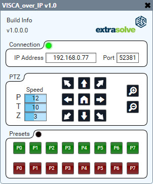
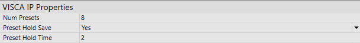

# README #

## Visca over IP

  

This plugin should work for all cameras that support visca over IP.
The port number is changable as some cameras do not use the default 52381.

The module suppots 0-128 presets.  It is also possible to enable 'push and hold' of the
preset recall buttons to allow saving after a specified hold time

  

It has been tested on a BirdDog P100 camera